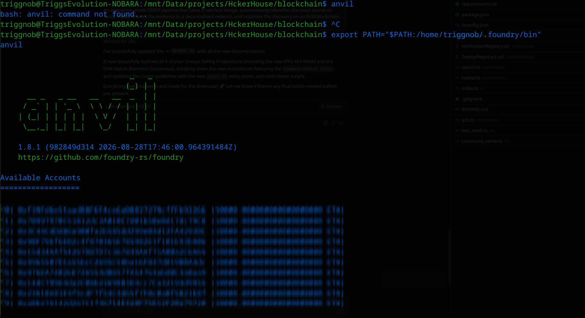

# 🛡️ Autonomous Forensic Attestation Pipeline (HH Goa 2026 - Task 3)

An enterprise-grade OSINT pipeline that takes a raw face image, autonomously identifies the exact source on social media, freezes the evidence to a decentralized network, and notarizes the discovery on an EVM blockchain.

## 🚀 The Unique Selling Propositions (USPs)

### USP 1: Dual-Layer Tamper Resistance (Solving the Compression Paradox)
Standard reverse-image pipelines fail because social platforms aggressively compress images (WebP conversions, EXIF stripping). A simple `SHA-256` of a downloaded image breaks instantly upon verification.
This project uses a **Dual-Layer Attestation**:
* **Layer A (Transport Proof):** SHA-256 of the raw discovered URL and timestamp.
* **Layer B (Invariant Proof):** A 64-bit Perceptual Hash (pHash) combined with a 128-dimensional biometric vector commitment. 
Even if Instagram compresses the image, the biometric and perceptual hashes remain stable, proving the identity inextricably belongs to the URL.

### USP 2: The IPFS 404-Shield (Decentralized Evidence Vault)
If a bad actor deletes their social media post, standard blockchain records point to a `404 Not Found` URL, destroying the evidence. 
The instant this pipeline discovers a post, it freezes the raw evidence and uploads it to the **InterPlanetary File System (IPFS)** via Pinata. The permanent `ipfs://` CID is written to the blockchain, ensuring the evidence survives platform deletion.

### USP 3: EVM-Native Biometric Consensus 🧮
Instead of doing math locally and asking the blockchain to "trust it", we force the **Ethereum Virtual Machine (EVM) to calculate the biometric match**. Python quantizes the 128-d face vector into `int16` fixed-point integers. The Solidity smart contract runs a 128-iteration `for`-loop to compute the **Cosine Similarity Dot Product** on-chain, actively rejecting transactions if the faces do not match by at least 85%.

### USP 4: Blinded Biometric Privacy (GDPR-Safe)
Storing raw facial vectors on a public ledger is a severe privacy violation. This pipeline utilizes a **Blinded Biometric Commitment scheme**. The biometric vectors are mathematically blinded using Keccak256 before being sent to the EVM. The public ledger only sees cryptographic noise, verifying identity without leaking Personally Identifiable Information (PII).

## 🏗️ Architecture

1. **The Python Chef (Computer Vision):** Uses OpenCV's DNN (YuNet) to detect faces, extract a 128-d biometric feature vector, and calculate a perceptual hash. It intelligently resizes the full image to bypass search API limits while maintaining context.
2. **The Command Center (TUI):** A `btop`-style dashboard written in TypeScript/Blessed that natively manages the Python environment, runs the pipeline, highlights clickable evidence URLs, and safely auto-exits via a timeout loop.
3. **The EVM Vault:** A Solidity smart contract (deployed on Anvil / Polygon Amoy) that calculates biometric dot-products and permanently stores the dual-layer fingerprints.

## 🌐 Environment-Agnostic Architecture (Why Anvil?)

This project is built using **Viem** and **Foundry**, making the codebase 100% environment-agnostic ("Write Once, Deploy Anywhere"). 

While the system is fully compatible with public testnets like Polygon Amoy, **Anvil (Local EVM)** is used as the default forensic environment for three enterprise-grade reasons:
1. **Privacy & OPSEC:** In real-world OSINT, uploading investigation timestamps to public block explorers alerts targets that they are being investigated. A local simulated node acts as a secure, private AppChain.
2. **Deterministic Reliability:** Public testnets rely on rate-limited third-party RPCs and faucets. Anvil provides zero-latency deterministic execution, crucial for iterating complex EVM math (like USP 3).
3. **Instant Migration:** Transitioning to a live public testnet requires **zero code refactoring**. We simply hot-swap the `RPC_URL` and `PRIVATE_KEY` in the `.env` file, and Viem automatically routes the transaction to the live internet.



## ⚙️ Installation & Setup

### Prerequisites
- Node.js (v18+) | Python (3.10+) | Foundry (Forge, Anvil, Cast)

### Setup Steps
1. **Install Dependencies:**
   ```bash
   npm install
   ```

2. **Environment Variables (.env):**
   ```env
   SERPAPI_API_KEY=your_serpapi_key
   PINATA_JWT=your_pinata_jwt
   AMOY_RPC_URL=http://127.0.0.1:8545
   PRIVATE_KEY=your_testnet_or_anvil_private_key
   REGISTRY_CONTRACT_ADDRESS=your_deployed_contract_address
   ```

3. **Start Local EVM & Deploy Vault:**
   ```bash
   anvil
   # In a new terminal:
   forge script contracts/script/DeployRegistry.s.sol:DeployRegistry --rpc-url http://127.0.0.1:8545 --broadcast
   ```

## 💻 Usage & Live Demos

### 1. The Command Center (Interactive UI)
Launch the beautiful btop-style dashboard. It automatically manages the Python `.venv` and executes the pipeline.
```bash
./start.sh images/test/test_image2.png
# Windows users: start.bat images/test/test_image2.png
```


### 2. The Red-Team Tamper Attack (Deepfake Simulation)
Simulates a bad actor attempting to verify a deepfake/tampered URL against the blockchain record. The smart contract intercepts the mismatch and triggers an INTEGRITY BREACH DETECTED alert.
```bash
./start.sh images/test/test_image2.png --tamper
```


### 3. EVM Math Tester (USP 3)
Run the isolated Solidity math test to prove the smart contract can calculate 128-d vector dot-products natively on-chain:
```bash
npx tsx src/test_math.ts
```


### 4. Standard Headless CLI (Legacy Mode)
You can still bypass the UI and run the pipeline headlessly:
```bash
npx tsx src/index.ts images/test/test_image2.png
```


```bash
npx tsx src/index.ts images/test/test_image2.png --tamper
```


## 🔗 Blockchain Details
- Configured for Anvil (zero-latency local forensic simulation) and 100% compatible with Polygon Amoy.
- Contract: Solidity ^0.8.20.
- Client: `viem` for robust EVM interactions.
